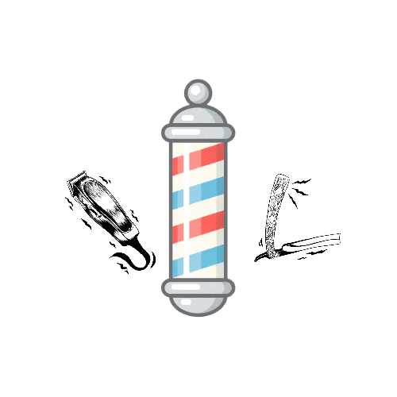

# Barbershop (Responsive web-page)

## Project Description:
- Web page of a barbershop that I have been developing through studies of some technologies.

## Key technologies I will use in this project:
- HTML5
- CSS3
- JavaScript

## Frameworks/Libraries
- jQuery
- jQuery UI
- jQuery Mask
- Owl Carousel
- Bootstrap

## References
- https://jquery.com/
- https://jqueryui.com/
- https://igorescobar.github.io/jQuery-Mask-Plugin/
- https://owlcarousel2.github.io/OwlCarousel2/
- https://getbootstrap.com/docs/5.2/getting-started/introduction/
- https://www.canva.com/
- https://www.favicon-generator.org/

